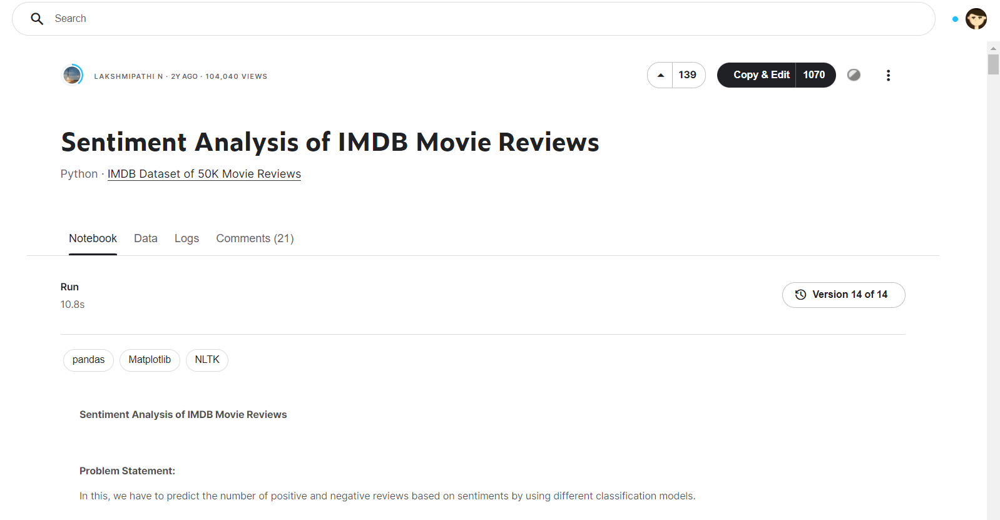

<h2> Sentiment Analysis Kaggle IMDB using LSTM </h2>
This project is suitable for beginner who want to under stand the NLP using LSTM.

<h3> Project Description </h3>
- My target is to classify the positive and negative review from users.  
- I use LSTM architecture

  
Kaggle Dataset I used: [Here](https://www.kaggle.com/lakshmi25npathi/sentiment-analysis-of-imdb-movie-reviews/data)
