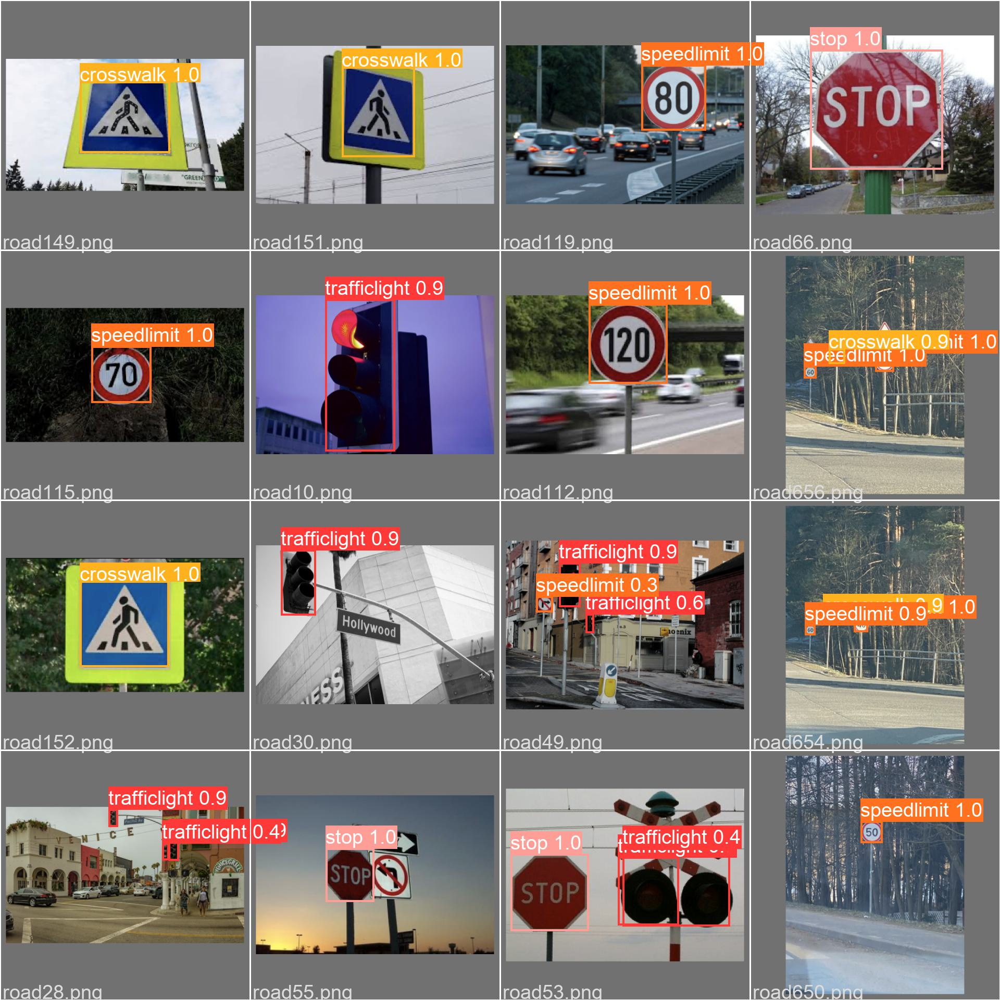
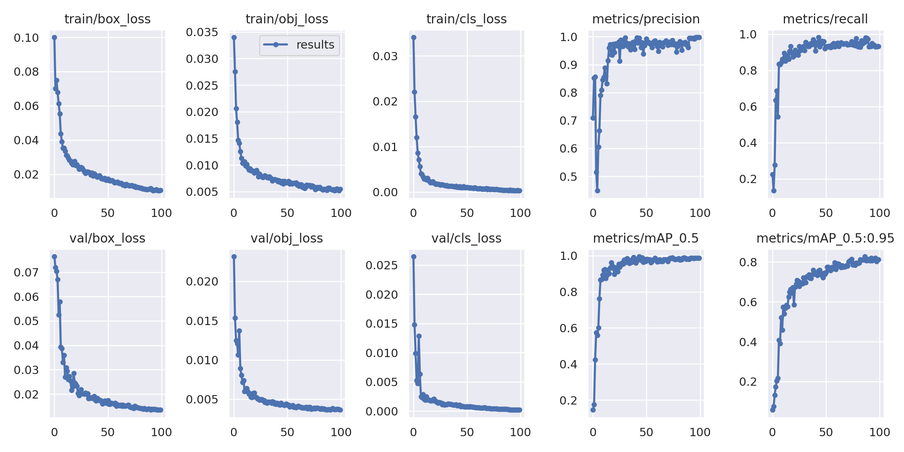

<h1>Road Sign Detection using Yolo v5 pretrained model</h1>
<h3> We used custom dataset from https://makeml.app/datasets/road-signs </h3>

 We used yolov5 pretrained model to detect road signs. The figure shown below is validation image. 

 
</img>

<h2> Overall Result </h2>
</img>

